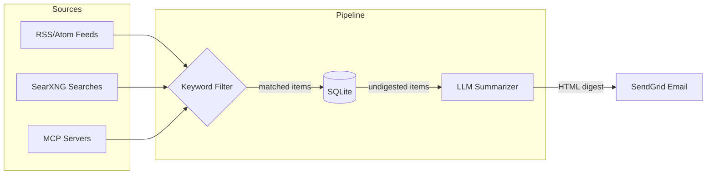

# Rustling

A command-line digest agent that collects content from RSS feeds and web searches, summarizes it with an LLM, and delivers a digest via email.

Designed to run on a schedule (e.g. cron). Each run is idempotent — duplicate items are ignored and unsent digests are retried automatically.

## How it works



1. **Collect** — Fetches items from configured RSS/Atom feeds, SearXNG searches, and MCP servers
2. **Filter** — Drops items not matching configured keywords (if set)
3. **Store** — Saves items to a local SQLite database, deduplicating by URL
4. **Summarize** — Sends new items to an LLM (Claude, Ollama, or any OpenAI-compatible endpoint) to generate a grouped HTML digest
5. **Deliver** — Emails the digest via SendGrid

## Setup

### Build

```sh
cargo build --release

# With MCP source support:
cargo build --release --features mcp
```

### Configure

Copy the example config and edit it:

```sh
cp rustling.example.toml rustling.toml
```

#### Feeds

Add RSS or Atom feed URLs:

```toml
[[feeds]]
name = "Hacker News"
url = "https://hnrss.org/frontpage"
category = "tech"

[[feeds]]
name = "Rust Blog"
url = "https://blog.rust-lang.org/feed.xml"
category = "rust"
```

#### SearXNG searches

Query a [SearXNG](https://docs.searxng.org/) instance to collect web search results:

```toml
[[searches]]
name = "Rust news"
instance_url = "https://searxng.example.com"
query = "rust programming language"
category = "rust"
time_range = "day"   # day (default), week, month, or year
```

Multiple searches can be configured. Each `[[searches]]` entry queries the given SearXNG instance and collects the results as digest items. The `time_range` parameter filters results to the specified recency.

#### MCP sources

Connect to any [Model Context Protocol](https://modelcontextprotocol.io/) server to fetch data by calling a tool. Requires building with `--features mcp`.

**Stdio transport** (spawns a local subprocess):

```toml
[[mcp_sources]]
name = "research-papers"
category = "research"
tool_name = "search_papers"

[mcp_sources.transport]
type = "stdio"
command = "/usr/local/bin/my-mcp-server"
args = ["--some-flag"]
env = { API_KEY = "secret" }       # optional env vars for the child process

[mcp_sources.tool_args]
query = "rust async patterns"
limit = 10

[mcp_sources.mapping]
strategy = "json_array"
url_field = "url"
title_field = "title"
content_field = "content"
```

**SSE/HTTP transport** (connects to a remote server):

```toml
[[mcp_sources]]
name = "remote-source"
category = "news"
tool_name = "fetch_articles"

[mcp_sources.transport]
type = "sse"
url = "http://localhost:8080/mcp"

[mcp_sources.tool_args]
topic = "technology"
```

**Mapping strategies** control how the MCP tool's response is converted into digest items:

| Strategy | Behavior |
|---|---|
| `json_array` (default) | Tool returns JSON text containing an array of objects. Fields are extracted by the configured `url_field`, `title_field`, and `content_field` keys. |
| `single_json` | Tool returns a single JSON object. Produces one item. |
| `text_block` | Each text content block in the response becomes one item (content only, no structured fields). |

If `mapping` is omitted, it defaults to `json_array` with `url_field = "url"`, `title_field = "title"`, `content_field = "content"`.

#### Keyword filtering

Optionally filter collected items (from all sources) by keywords. Items whose title or content don't contain at least one keyword are dropped before storage:

```toml
keywords = "rust, kubernetes, llm, security"
```

If omitted, all items are kept.

#### LLM provider

Choose one of three providers:

**Claude (Anthropic API):**

```toml
[llm]
provider = "claude"
endpoint = "https://api.anthropic.com/v1/messages"
model = "claude-sonnet-4-20250514"
```

**Ollama (local):**

```toml
[llm]
provider = "ollama"
endpoint = "http://localhost:11434/api/generate"
model = "llama3"
```

**OpenAI-compatible:**

```toml
[llm]
provider = "openai_compat"
endpoint = "https://api.openai.com/v1/chat/completions"
model = "gpt-4"
```

You can optionally override the summarization prompt:

```toml
[llm]
prompt_template = "Your custom system prompt here..."
```

#### Email

```toml
[email]
from = "digest@yourdomain.com"
to = ["alice@example.com", "bob@example.com"]
subject_prefix = "Rustling Digest"
```

#### General settings

```toml
database_path = "rustling.db"   # SQLite database location
lookback_hours = 24             # How far back to include items
max_items_per_digest = 50       # Cap items sent to the LLM
verbose = false                 # Enable debug-level logging
```

### Environment variables

Set these before running:

```sh
export SENDGRID_API_KEY="SG.your-key-here"
export LLM_API_KEY="sk-your-key-here"  # required for Claude and OpenAI-compat; not needed for Ollama
```

## Usage

```sh
# Run with default config (./rustling.toml)
cargo run --release

# Run with a specific config file
cargo run --release -- /path/to/rustling.toml
```

### Running on a schedule

Add a crontab entry to run daily at 8am:

```
0 8 * * * cd /path/to/rustling && SENDGRID_API_KEY=... LLM_API_KEY=... ./target/release/rustling
```

### Logging

Rustling uses `tracing` for structured logging. Control verbosity with `RUST_LOG`:

```sh
RUST_LOG=rustling=debug cargo run    # verbose output
RUST_LOG=rustling=warn cargo run     # only warnings and errors
```
